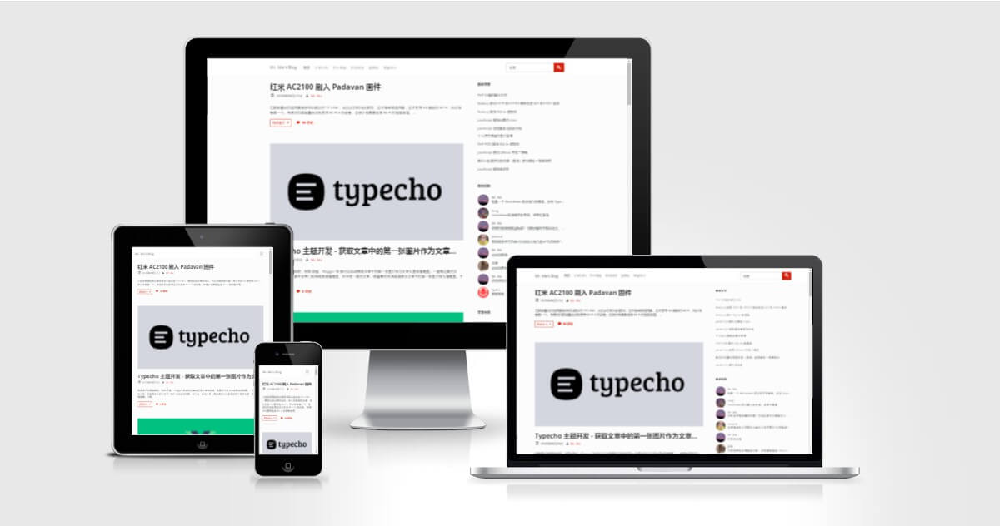
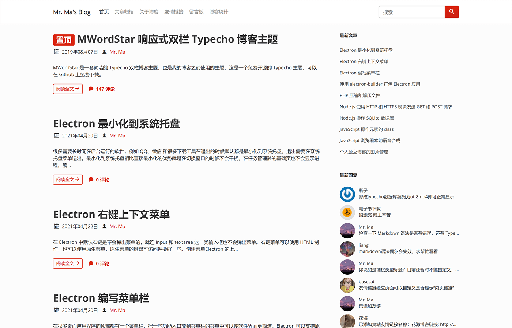
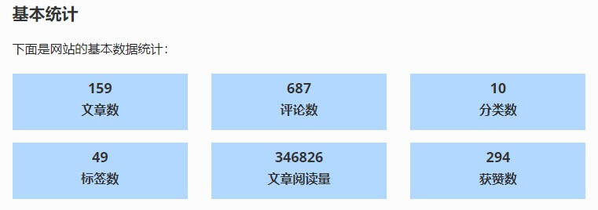
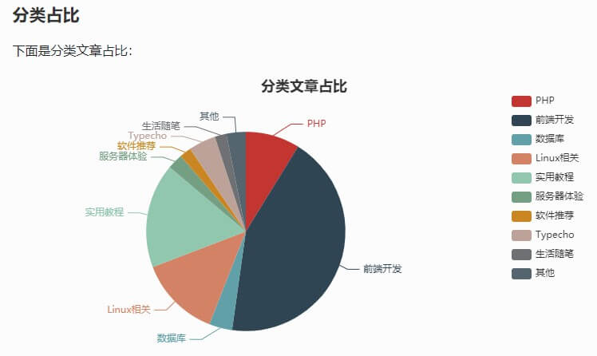
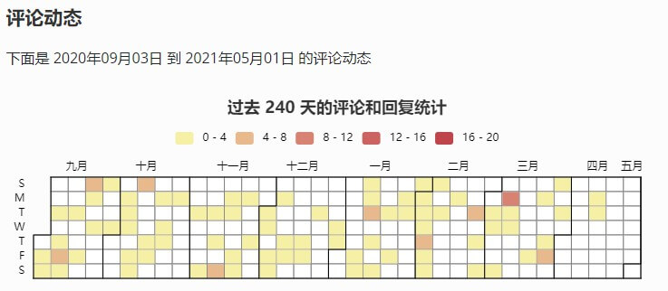
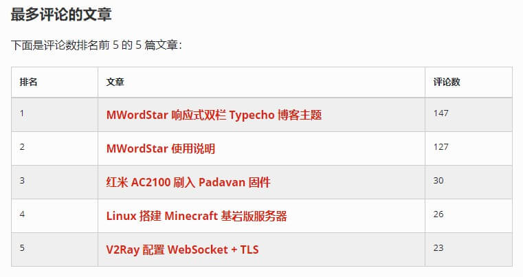
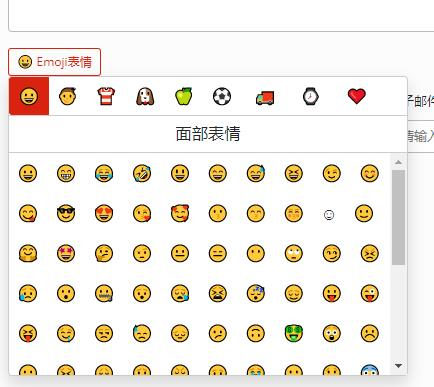

Facile 是一套简洁的 Typecho 博客主题，也是我的博客正在使用的主题。

之前我用的主题是 [MWordStar](https://www.misterma.com/archives/812/) ，时间长了就想换一下外观，本来想再给 MWordStar 增加一套样式，但是外观变动比较大，而且 MWordStar 已经有几套样式了，所以重新开发一套主题。

主题演示地址：[https://www.misterma.com/](https://www.misterma.com/) 

主题下载地址：[https://github.com/changbin1997/Facile/releases](https://github.com/changbin1997/Facile/releases) 

下载时请选择 `Facile-bundle.zip` ，否则前端 JS 代码无法在 IE 系列浏览器运行。

主题使用帮助：[https://facile.misterma.com/](https://facile.misterma.com/) 

下面是主题首页截图：

不包含文章头图的截图：

小头图模式：

也可以给文章设置单独的头图样式：

Facile 相比 [MWordStar](https://github.com/changbin1997/MWordStar) 来说，外观要更简洁一些，功能也会少一些，MWordStar 有的功能以后也会陆续增加到 Facile 中，但是 Facile 的功能以后也不会有 MWordStar 多。

## 特点和功能

* 响应式设计
* 无障碍适配（Accessibility）
* 包含浅色和深色两套配色
* 代码高亮
* 自带点赞功能
* 支持根据文章内插入的标题生成章节目录
* 支持图片懒加载
* 支持文章分页
* 丰富的侧边栏组件
* 丰富的设置选项
* 详细的图表统计
* 评论区自带 Emoji 表情面板
* 详细的 [帮助文档](https://facile.misterma.com/) （必看）
* 长期维护

## 安装

在 Releases 下载的主题是一个 zip 格式的压缩包，把压缩包上传到 Typecho 目录下的 `usr/themes/` 目录，然后解压，解压后应该可以看到一个 `Facile` 目录。

登录 Typecho 后台，在顶部导航栏的 `控制台` 菜单选择 `外观` ，如果存放位置没有错误的话就可以看到 Facile 主题了，点击 `启用` 。

## 主题依赖

主题主要用到了以下几个库：

* [bootswatch](https://github.com/thomaspark/bootswatch) 不同风格的 Bootstrap 主题
* [jQuery](https://jquery.com/) DOM 操作和 Bootstrap 依赖
* [qrious](https://github.com/neocotic/qrious) 生成二维码的 JS 库
* [highlight.js](https://highlightjs.org/) 代码高亮
* [ECharts](https://github.com/apache/echarts) 百度开源的图表库，用于 [统计页](https://www.misterma.com/data.html) 生成统计图

后端没有用到任何库。

ECharts 的库比较大，所以只引入了饼图和日历图，而且只会在统计页加载。Bootstrap 的 JS 使用 Webpack 打包过的发行版也只引入了用到的模块。

主题的图标使用的是 [IcoMoon](https://icomoon.io/) 的字体图标，IcoMoon 的图标可以自定义，所以主题中只包含几个用到的图标。

前端 JS 使用的是 ES6 语法，在 IE 系列的浏览器（包括 IE11）是无法运行的，如果没有二次开发需求的话，可以在 [Releases](https://github.com/changbin1997/Facile/releases) 下载 `Facile-bundle.zip` 发行版，发行版使用了 Webpack + Babel 来打包和转换，可以在 IE 运行。

## 代码高亮

代码高亮目前包含三套主题配色，分别是 Stack Overflow（浅色）、VS2015（深色）、Sunburst（高对比度）。目前支持 30 多种语言的代码高亮。

要查看支持的语言列表和代码高亮样式可以访问 [帮助文档 - 代码高亮](https://facile.misterma.com/%E4%BB%A3%E7%A0%81%E9%AB%98%E4%BA%AE.html)

## 侧边栏

下面是目前可以显示在侧边栏的组件：

- 博客信息
- 主题配色
- 最新文章
- 最新回复
- 文章分类
- 标签云
- 文章归档
- 其它功能
- 友情链接
- 目录

侧边栏的每个组件你都可以选择开启或关闭，你还可以自定义侧边栏的组件排序顺序。

## 统计页

主题包含一个统计页模板，你可以在后台创建页面，页面的自定义模板选择 `网站数据`，标题可以随便写，创建完成后就可以在顶部导航栏访问了。

统计页包含基本的数据统计、分类文章占比图、文章更新日历图、评论动态日历图、阅读量排名前 5 的文章、评论量排名前 5 的文章。

基本数据统计如下：

分类占比统计图如下：

下面是评论动态日历图：

文章动态日历图和评论动态的日历图是差不多的，屏幕尺寸不同显示的月份数量也不同。

下面是文章评论排名表格：

文章阅读量排名表格和评论量排名的表格也是差不多的。

统计页面演示可以访问 [https://www.misterma.com/data.html](https://www.misterma.com/data.html) 。

## Emoji 表情

主题评论区包含一个 Emoji 表情面板，你可以在后台启用或禁用。Emoji 表情面板包含 1466 个表情，这些表情都是按照分类动态加载的，不用担心性能问题。

Emoji 表情面板也进行了无障碍适配，可支持键盘访问和屏幕阅读器朗读。

下面是 Emoji 表情面板的截图：

## 无障碍（Accessibility）

上网对于大多数人来说是一件再简单不过的事，但是对于一些身体有缺陷的残障人士来说却是一件非常困难的事。目前国内的很多网站和 App 都只注重外观，忽略了残障人士的 [可访问性](https://www.misterma.com/archives/264/)，甚至有的 App 在开启屏幕阅读器的情况下都无法正常使用。

Facile 主题针对屏幕阅读器做了大量优化，并在 [MVDA](http://www.nvda-project.org/) 和 [VoiceOver](https://www.apple.com/cn/accessibility/iphone/vision/) 这两款屏幕阅读器上做过测试，无论是 PC 还是移动设备都能完美朗读（除了日历图），主题能准确传达需要朗读的内容和信息，对于盲人来说，使用标准的屏幕阅读器基本可以无障碍操作。

主题可完美支持键盘访问，颜色对比度也符合标准。

小提示：如果您是屏幕阅读器用户，为了您的浏览体验，不建议使用 IE 浏览器。

## 友情链接

友情链接分为 `全站友情链接`、`首页友情链接`、`内页友情链接`。`全站友情链接` 会在每个页面的侧边栏显示，`首页友情链接` 会在首页的侧边栏显示，`内页友情链接` 只会在 友情链接 的页面显示。

要查看友情链接的设置说明可以访问 [帮助文档 - 主题设置](https://facile.misterma.com/%E4%B8%BB%E9%A2%98%E8%AE%BE%E7%BD%AE.html#%E8%BF%9B%E5%85%A5%E4%B8%BB%E9%A2%98%E8%AE%BE%E7%BD%AE)

## 插件适配

因为我需要用到 [Sticky](https://plugins.typecho.me/plugins/sticky.html) 文章置顶插件，所以这个主题也直接适配了 Sticky 插件，Sticky 插件安装完成后无需修改主题。

## 兼容性

主题用到了少量的 CSS3，常见的浏览器都能完美兼容，IE 系列浏览器需要达到 IE10 才能完美兼容。

JavaScript 用到了 ES6，打包的发行版可以完美兼容 IE，开发版不支持 IE 系列浏览器和一些较老的浏览器。

## 打赏支持

如果主题用着感觉还可以的话，也可以扫描下方的二维码打赏，金额随意：

非常感谢 ❤️